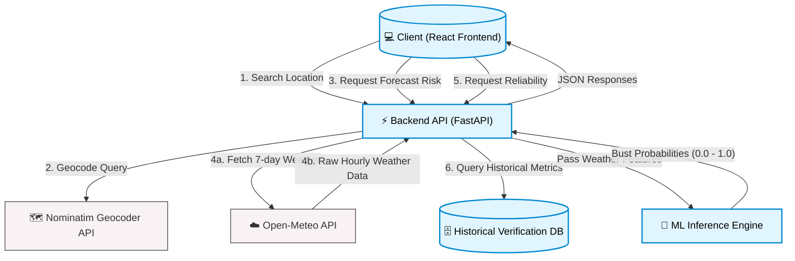

# Data Flow Diagram & Specifications

This document outlines the end-to-end data architecture and flow for the **MeghDrishti** Weather Intelligence Platform.

## 1. High-Level Architecture Diagram

---

## 2. Detailed Data Flow Pipelines

### 2.1. Location Resolution Pipeline (Geocoding)
1. **Trigger**: User types a location in the frontend search bar.
2. **Request**: Frontend calls `GET /api/geocode?q={query}`.
3. **Processing**: Backend forwards the query to the external **OpenStreetMap Nominatim API**.
4. **Response**: Backend receives latitude, longitude, and display names, normalizes them, and returns them to the frontend.

### 2.2. Core Prediction Pipeline (Forecast Bust Risk)
This is the primary ML pipeline of the application.
1. **Trigger**: User selects a specific location (using lat/lon).
2. **Request**: Frontend calls `GET /api/predictions?latitude={lat}&longitude={lon}`.
3. **Data Acquisition**: Backend queries the **Open-Meteo API** to fetch ~168 hours (7 days) of raw hourly weather forecasts (temperature, humidity, precipitation, pressure, cloud cover, wind speed, wind direction).
4. **Feature Engineering**: The raw weather JSON is parsed and fed into the AI feature preparation layer. Features are normalized/scaled to match the exact format used during model training.
5. **Inference**: The prepared features are passed to the loaded Binary Classification model (e.g., XGBoost). The model returns:
   - `prediction`: 0 (Reliable) or 1 (Bust)
   - `bust_probability`: Float between 0.00 and 1.00.
6. **Aggregation**: The backend identifies the peak probability and assigns an overall categorical application risk:
   - `High`: $\ge 70\%$
   - `Medium`: $40\% - 69.99\%$
   - `Low`: $< 40\%$
7. **Response**: The backend aggregates the raw weather, predictions, and summary statistics into a single JSON response for the frontend charts and tables.

### 2.3. Historical Reliability Pipeline
1. **Trigger**: Dashboard loads for a location.
2. **Request**: Frontend calls `GET /api/reliability?location_name={name}`.
3. **Processing**: Backend queries the local database containing historical forecast-vs-observed comparisons.
4. **Response**: 
   - If sufficient data exists, it returns calculated metrics (Temperature MAE/RMSE, Humidity MAE, Sample Size).
   - If insufficient data exists, it returns a safe `insufficient_data` status, preventing the frontend from displaying fabricated metrics.

---

## 3. Data Privacy & Rate Limiting
- **External API Rate Limits**: Calls to Open-Meteo and Nominatim are subject to upstream rate limits. Future iterations should implement Redis caching at the FastAPI layer to prevent external throttling on repeated requests for the same coordinates.
- **Data Persistence**: Only historical verification data is stored locally. Real-time predictions are stateless and generated on-the-fly.
